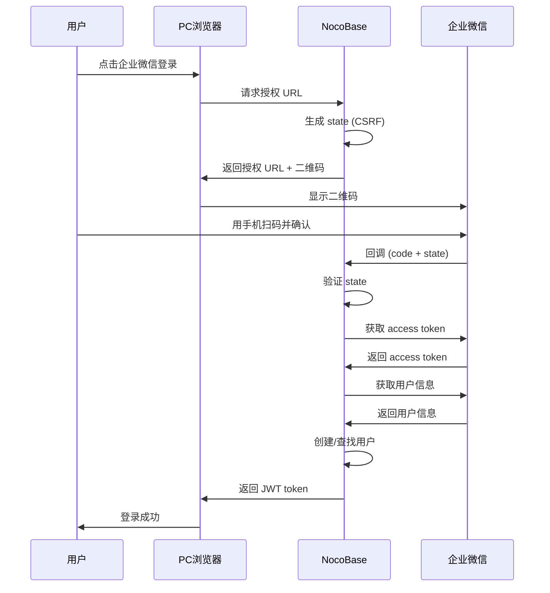
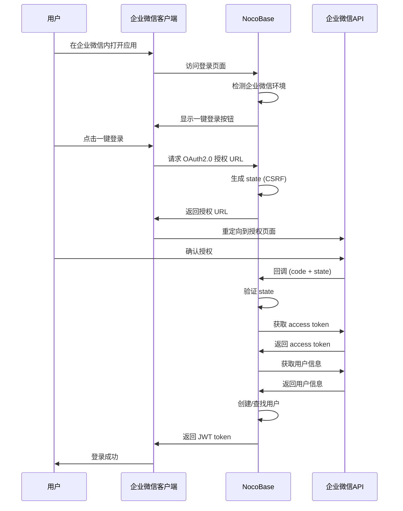

# 设计文档

## 概述

企业微信认证插件为 NocoBase 提供基于 OAuth 2.0 的企业微信认证功能。该插件遵循 NocoBase 的认证插件架构，通过扩展 `@nocobase/auth` 插件来实现企业微信身份验证。

### 核心功能

- 企业微信 OAuth 2.0 认证流程（支持两种模式）
  - PC 扫码登录（使用 QR Code）
  - 企业微信内一键登录（OAuth2.0 授权）
- 自动环境检测（企业微信内 vs PC 浏览器）
- 自动用户注册
- 用户账号与企业微信身份绑定
- 管理员配置界面

### 技术栈

- **服务端**: Node.js, @nocobase/server, @nocobase/auth
- **客户端**: React, @nocobase/client, Ant Design
- **API 集成**: 企业微信 API (axios)
- **安全**: OAuth 2.0, CSRF 保护 (state 参数), HTTPS

## 架构

### 插件结构

```
@my-nocobase/plugin-auth-wecom/
├── src/
│   ├── client/              # 客户端代码
│   │   ├── index.tsx        # 客户端插件入口
│   │   ├── SignInButton.tsx # 登录按钮组件
│   │   ├── AdminSettings.tsx # 管理员配置表单
│   │   └── locale/          # 国际化
│   ├── server/              # 服务端代码
│   │   ├── plugin.ts        # 服务端插件入口
│   │   ├── wecom-auth.ts    # 认证逻辑
│   │   ├── wecom-service.ts # 企业微信 API 服务
│   │   ├── actions.ts       # HTTP 动作处理器
│   │   └── collections/     # 数据库扩展
│   │       └── users.ts     # 用户表扩展
│   ├── constants.ts         # 常量定义
│   ├── types.ts             # TypeScript 类型
│   └── locale/              # 服务端国际化
└── package.json
```

### 认证流程

#### 流程 1: PC 扫码登录（已实现）



#### 流程 2: 企业微信内一键登录（新增）



## 组件和接口

### 服务端组件

#### 1. WeComAuth (认证器)

继承自 `BaseAuth`，实现企业微信认证逻辑。

```typescript
class WeComAuth extends BaseAuth {
  async validate(): Promise<Model>
  async getUserInfo(code: string): Promise<WeComUserInfo>
  async createOrBindUser(userInfo: WeComUserInfo): Promise<Model>
}
```

**职责**:
- 验证 OAuth 授权码
- 获取企业微信用户信息
- 创建或绑定 NocoBase 用户账号
- 处理自动注册逻辑

#### 2. WeComService (API 服务)

封装企业微信 API 调用。

```typescript
class WeComService {
  getAuthorizationUrl(redirectUri: string, state: string, loginType?: 'qrcode' | 'oauth'): string
  async getAccessToken(): Promise<string>
  async getUserInfo(code: string): Promise<WeComUserInfo>
}
```

**职责**:
- 生成 OAuth 授权 URL（支持两种模式：PC 扫码和移动端 OAuth）
- 获取企业微信 access token
- 调用企业微信用户信息接口
- 实现重试机制和错误处理

#### 3. Actions (HTTP 处理器)

处理 OAuth 回调和授权请求。

```typescript
async function callback(ctx: Context, next: Next): Promise<void>
async function getAuthUrl(ctx: Context, next: Next): Promise<void>
```

**职责**:
- 处理 OAuth 回调请求
- 验证 state 参数
- 生成授权 URL
- 返回 JWT token

### 客户端组件

#### 1. SignInButton (登录按钮)

显示企业微信登录按钮，根据环境自动选择登录方式。

```typescript
const SignInButton: React.FC<{
  authenticator: string
}> = ({ authenticator }) => {
  // 检测是否在企业微信环境
  // 企业微信内：显示一键登录按钮，点击后重定向到 OAuth 授权
  // PC 浏览器：显示二维码扫码登录
}
```

**职责**:
- 检测用户访问环境（企业微信 vs PC 浏览器）
- 在企业微信内显示一键登录按钮
- 在 PC 浏览器显示二维码
- 处理不同登录流程

#### 2. AdminSettings (配置表单)

管理员配置企业微信认证器的表单。

```typescript
const AdminSettings: React.FC<{
  value: WeComOptions
  onChange: (value: WeComOptions) => void
}> = ({ value, onChange }) => {
  // 企业 ID
  // 应用 ID
  // 应用密钥
  // 回调 URL
  // 自动注册开关
  // 默认角色
}
```

### API 端点

| 端点 | 方法 | 权限 | 说明 |
|------|------|------|------|
| `/api/wecom:getAuthUrl` | POST | public | 获取授权 URL（支持 loginType 参数：qrcode/oauth） |
| `/api/wecom:callback` | GET | public | OAuth 回调处理 |

**getAuthUrl 参数**:
- `authenticator`: 认证器名称（必需）
- `loginType`: 登录类型，可选值：
  - `qrcode`: PC 扫码登录（默认）
  - `oauth`: 企业微信内 OAuth2.0 登录

## 数据模型

### 用户表扩展

扩展 `users` 表，添加企业微信相关字段：

```typescript
{
  wecomUserId: string    // 企业微信用户 ID (唯一)
  wecomOpenId: string    // 企业微信 OpenID (可选)
  wecomUnionId: string   // 企业微信 UnionID (可选)
}
```

### 认证器配置

存储在 `authenticators` 表的 `options` 字段：

```typescript
interface WeComOptions {
  public: {
    autoSignup: boolean      // 是否自动注册
    defaultRole?: string     // 默认角色名称
  }
  corpId: string            // 企业 ID
  agentId: string           // 应用 ID
  secret: string            // 应用密钥
  callbackUrl: string       // 回调 URL
}
```

## 正确性属性

*属性是一个特征或行为，应该在系统的所有有效执行中保持为真——本质上是关于系统应该做什么的形式化陈述。属性作为人类可读规范和机器可验证正确性保证之间的桥梁。*

### 属性 1: 配置保存完整性
*对于任意*有效的认证器配置（包含企业 ID、应用 ID、应用密钥），保存后从数据库读取应该得到相同的配置值
**验证需求: 1.3**

### 属性 2: 启用状态与 UI 显示一致性
*对于任意*认证器，其启用状态应该与登录页面是否显示该认证选项保持一致
**验证需求: 1.4, 1.5, 2.1**

### 属性 3: OAuth 授权码处理
*对于任意*有效的授权码，系统应该能够完成 OAuth 流程并获取用户信息
**验证需求: 2.3, 2.4**

### 属性 4: 用户信息到会话的转换
*对于任意*成功获取的企业微信用户信息，系统应该能够创建有效的登录会话
**验证需求: 2.5**

### 属性 5: 自动注册功能
*对于任意*新的企业微信用户，当自动注册启用时，系统应该创建新用户账号并自动登录
**验证需求: 3.1, 3.5**

### 属性 6: 用户数据映射完整性
*对于任意*新创建的用户，应该包含企业微信用户 ID 作为唯一标识符，并保存从企业微信获取的昵称
**验证需求: 3.2, 3.3**

### 属性 7: 默认角色分配
*对于任意*新用户，如果配置了默认角色，该用户应该被分配该角色
**验证需求: 3.4**

### 属性 8: State 参数往返一致性
*对于任意*生成的 OAuth 请求，其 state 参数在回调时应该与原始值匹配，否则请求应该被拒绝
**验证需求: 4.1, 4.2, 4.3**

### 属性 9: HTTPS 协议使用
*对于任意*企业微信 API 调用，应该使用 HTTPS 协议
**验证需求: 4.4**

### 属性 10: API 错误处理
*对于任意*企业微信 API 错误，系统应该记录错误日志并返回友好的错误消息
**验证需求: 5.1**

### 属性 11: 输入验证
*对于任意*缺失或无效的授权码，系统应该拒绝请求并返回错误信息
**验证需求: 5.2**

### 属性 12: 网络重试机制
*对于任意*网络请求失败，系统应该自动重试最多 3 次
**验证需求: 5.3**

### 属性 13: Access Token 前置条件
*对于任意*企业微信 API 调用，系统应该首先获取有效的 access token
**验证需求: 6.1**

### 属性 14: 响应格式验证
*对于任意*企业微信 API 成功响应，系统应该能够验证响应格式并提取必要字段
**验证需求: 6.4**

### 属性 15: 环境检测准确性
*对于任意*用户代理字符串，系统应该能够准确判断是否在企业微信环境中
**验证需求: 9.1**

### 属性 16: 登录方式与环境一致性
*对于任意*检测到的环境，显示的登录方式应该与环境匹配（企业微信内显示一键登录，PC 显示二维码）
**验证需求: 9.2, 9.3**

### 属性 17: OAuth2.0 授权流程完整性
*对于任意*在企业微信内发起的登录请求，应该使用 OAuth2.0 授权流程并成功获取用户信息
**验证需求: 8.2, 8.3, 8.4**

### 属性 18: 授权 URL 类型正确性
*对于任意*登录类型参数（qrcode/oauth），生成的授权 URL 应该使用对应的企业微信端点
**验证需求: 8.2**

## 错误处理

### 错误类型

1. **配置错误**
   - 缺少必需配置项
   - 无效的企业 ID/应用 ID/密钥
   - 处理: 在配置保存时验证，返回明确的错误消息

2. **OAuth 流程错误**
   - 授权码缺失或无效
   - State 参数不匹配 (CSRF 攻击)
   - 处理: 返回 400 错误，记录日志，提示用户重试

3. **API 调用错误**
   - 网络超时
   - 企业微信 API 返回错误码
   - Token 过期
   - 处理: 自动重试（最多 3 次），记录详细日志，返回友好错误消息

4. **用户创建错误**
   - 自动注册被禁用
   - 数据库约束冲突
   - 角色不存在
   - 处理: 返回明确的错误消息，记录日志

### 重试策略

使用指数退避策略：
- 第 1 次重试: 1 秒后
- 第 2 次重试: 2 秒后
- 第 3 次重试: 4 秒后

仅对以下错误重试：
- 网络超时 (ETIMEDOUT, ECONNABORTED)
- 连接错误 (ECONNREFUSED, ENOTFOUND)
- 企业微信 API 临时错误 (如 rate limit)

### 日志记录

- **INFO**: 成功的认证事件
- **WARN**: 可恢复的错误（如角色分配失败）
- **ERROR**: 认证失败、API 错误、CSRF 攻击尝试

敏感信息（token、secret）在日志中自动脱敏。

## 测试策略

### 单元测试

使用 Vitest 进行单元测试，覆盖：

1. **WeComService 测试**
   - URL 生成正确性
   - API 响应解析
   - 错误处理和重试逻辑

2. **WeComAuth 测试**
   - 用户创建/查找逻辑
   - 角色分配
   - 自动注册开关

3. **Actions 测试**
   - State 参数验证
   - 回调处理
   - 错误响应格式

4. **数据模型测试**
   - 用户表扩展字段
   - 唯一性约束

### 属性测试

使用 fast-check 进行属性测试，每个测试运行至少 100 次迭代：

1. **配置往返测试**
   - 生成随机配置 → 保存 → 读取 → 验证一致性

2. **State 参数测试**
   - 生成随机 state → 存储 → 验证 → 应该成功
   - 生成随机 state → 使用不同值验证 → 应该失败

3. **用户数据映射测试**
   - 生成随机企业微信用户信息 → 创建用户 → 验证字段映射

4. **错误处理测试**
   - 生成各种错误场景 → 验证错误消息格式和日志记录

5. **重试机制测试**
   - 模拟网络错误 → 验证重试次数和延迟

每个属性测试必须使用注释标记对应的设计文档属性：
```typescript
// Feature: wecom-auth-plugin, Property 8: State 参数往返一致性
```

### 集成测试

测试完整的认证流程：

1. 配置认证器
2. 模拟 OAuth 回调
3. 验证用户创建
4. 验证会话生成

### 测试工具

- **单元测试**: Vitest
- **属性测试**: fast-check (JavaScript 属性测试库)
- **HTTP 模拟**: nock 或 msw
- **数据库**: 测试数据库实例

## 安全考虑

1. **CSRF 保护**: 使用 state 参数验证 OAuth 回调
2. **HTTPS**: 所有企业微信 API 调用使用 HTTPS
3. **敏感数据**: 应用密钥加密存储，日志中脱敏
4. **输入验证**: 验证所有用户输入和 API 响应
5. **会话安全**: 使用 NocoBase 的 JWT 机制

## 性能考虑

1. **Token 缓存**: Access token 缓存 2 小时（企业微信默认过期时间）
2. **数据库索引**: wecomUserId 字段添加唯一索引
3. **并发处理**: 支持多个并发登录请求
4. **超时设置**: API 请求超时 30 秒

## 国际化

支持语言：
- 简体中文 (zh-CN)
- 英文 (en-US)

翻译内容：
- UI 文本
- 错误消息
- 配置表单标签
- 帮助文本

## 依赖

### 服务端依赖

- `@nocobase/server`: NocoBase 服务端核心
- `@nocobase/auth`: 认证框架
- `@nocobase/database`: 数据库操作
- `axios`: HTTP 客户端
- `crypto`: 生成随机 state

### 客户端依赖

- `@nocobase/client`: NocoBase 客户端核心
- `@nocobase/plugin-auth/client`: 认证插件客户端
- `react`: UI 框架
- `antd`: UI 组件库

### 开发依赖

- `@nocobase/test`: 测试工具
- `vitest`: 测试框架
- `fast-check`: 属性测试库

## 部署注意事项

1. **企业微信配置**
   - 在企业微信管理后台创建应用
   - 配置可信域名
   - 获取企业 ID、应用 ID、应用密钥

2. **NocoBase 配置**
   - 确保使用 HTTPS（生产环境）
   - 配置正确的回调 URL
   - 启用会话支持

3. **网络要求**
   - 服务器能够访问企业微信 API (qyapi.weixin.qq.com)
   - 回调 URL 可从互联网访问

## 未来扩展

MVP 版本不包含以下功能，可在后续版本中添加：

1. 用户主动绑定/解绑企业微信账号
2. 部门信息同步
3. 用户信息定期同步
4. 多应用支持
5. 管理员强制绑定企业微信
6. 登录日志和审计
